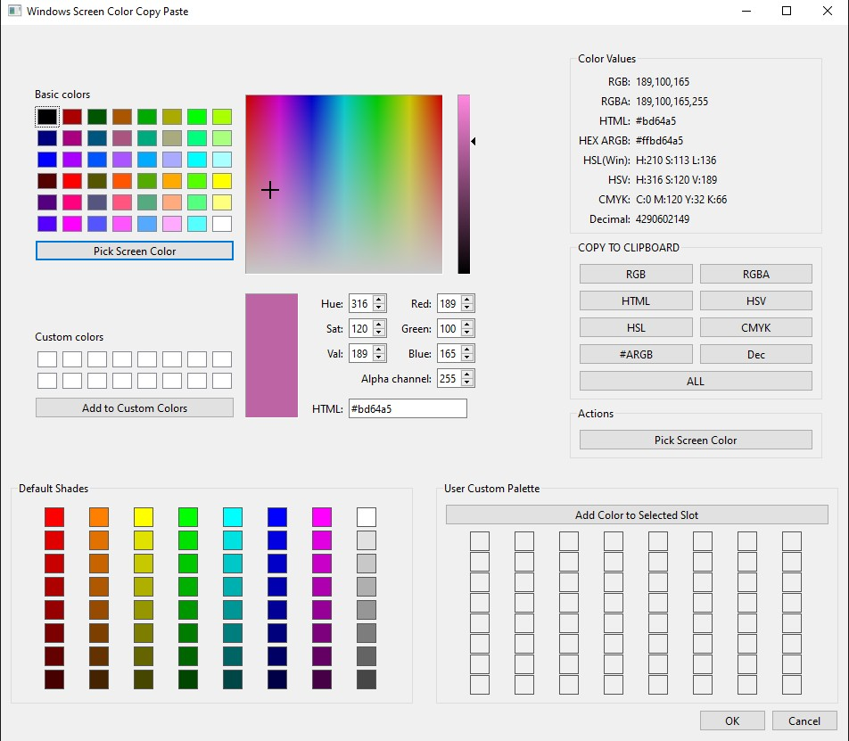
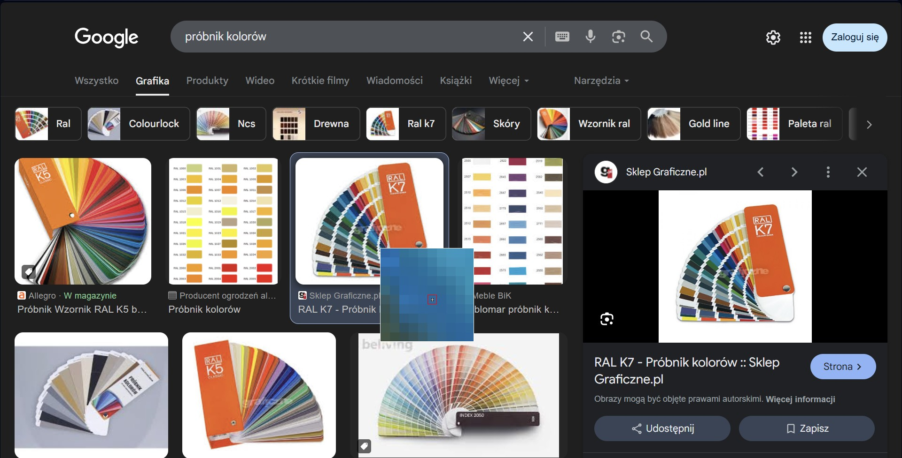
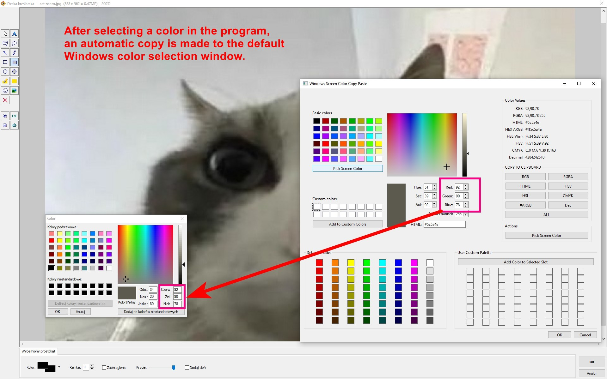

Magnify option (if click Acttions: Pick Screen Color)





# Windows Screen Color Copy Paste

A utility (EXE or Python script utility built with PySide6) for picking colors from your screen, managing custom color palettes, and copying color values in various formats. It also features a unique ability to send RGB values directly to the standard Windows "Kolor" (Color) dialog, often used by applications like MS Paint.

## Key Features

*   **Screen Color Picker:** Pick any color from your screen with a live magnifier showing the area around your cursor.
*   **Rich Color Dialog:** Utilize an embedded `QColorDialog` for fine-tuning colors or selecting from standard/custom swatches.
*   **Multiple Color Formats:** View and copy the selected color in various formats:
    *   RGB (e.g., `255,100,50`)
    *   RGBA (e.g., `255,100,50,255`)
    *   HTML/Hex RGB (e.g., `#FF6432`)
    *   Hex ARGB (e.g., `#FFFF6432`)
    *   HSL (Windows-normalized, 0-239 for Hue, 0-240 for Sat/Lum)
    *   HSV (QColor standard, 0-359 for Hue, 0-255 for Sat/Val)
    *   CMYK
    *   Decimal (QRgb integer value)
*   **Clipboard Integration:**
    *   Copy individual color formats with dedicated buttons.
    *   Copy all formats at once.
*   **Custom Color Palettes:**
    *   **Standard Dialog Custom Colors:** The 16 custom color slots in the `QColorDialog` are saved and loaded.
    *   **Default Shades Palette (8x8):** A pre-populated palette of shades that can be customized. Right-click a cell to save the current main color to it.
    *   **User Custom Palette (8x8):** An empty 8x8 palette for your own frequently used colors.
        *   Left-click a cell to select the *slot*.
        *   Then click "Add Color to Selected Slot" to save the current main color from the `QColorDialog` to this selected slot.
        *   Alternatively, right-click a cell to directly save the current main color to it.
*   **"Kolor" Dialog Integration (Windows Only):**
    *   If the standard Windows color dialog (often titled "Kolor" in Polish Windows, or "Color" in English versions) is open, this application will attempt to send the selected RGB values to it. This is useful for quickly setting colors in applications like MS Paint that use this system dialog.
    *   During screen picking, the color under the mouse cursor (in the magnifier) is continuously sent to the "Kolor" dialog if it's open.
*   **Persistent Settings:**
    *   All custom colors and palette configurations are saved to `Windows_Screen_Color_Copy_Paste.ini` in the application's directory and loaded automatically on startup.

## How to Use

1.  **Run the Application:** Execute the `Windows Screen Color Copy Paste.py` script.
2.  **Selecting a Color:**
    *   Use the embedded `QColorDialog` to pick or define a color.
    *   The selected color's values will be displayed in various formats on the right.
3.  **Picking from Screen:**
    *   Click the "**Pick Screen Color**" button.
    *   The main dialog might hide. Wait a moment (default 2 seconds) for the screen picker and magnifier to activate fully.
    *   A magnifier window will appear, showing a zoomed-in view around your mouse cursor.
    *   Move your mouse. The color under the central pixel of the magnifier will be continuously sent to the "Kolor" dialog (if open).
    *   **Left-click** to select the color. The chosen color will be set in the main dialog, its RGB value copied to the clipboard, and sent to the "Kolor" dialog.
    *   Press **Escape** to cancel screen picking.
    *   The picker will close automatically after a short delay post-selection.
4.  **Using Palettes:**
    *   **Clicking a color cell** in any palette will set that color as the current color in the `QColorDialog`.
    *   **Saving to Default Shades Palette:** Right-click on a cell in the "Default Shades" palette and choose "Save Current Color Here".
    *   **Saving to User Custom Palette:**
        *   To select a slot: Left-click a cell in the "User Custom Palette". It will be highlighted.
        *   To save the current main color (from `QColorDialog`) to the *selected slot*: Click the "**Add Color to Selected Slot**" button.
        *   Alternatively, to directly save the current main color to any cell: Right-click on a cell in the "User Custom Palette" and choose "Save Current Color Here".
5.  **Copying Colors:**
    *   Click any of the format buttons (RGB, HTML, etc.) in the "COPY TO CLIPBOARD" group to copy that specific format.
    *   Click "**ALL**" to copy all available formats to the clipboard, each on a new line.
6.  **Saving Settings:**
    *   Custom colors in the `QColorDialog` (16 slots) and both 8x8 palettes are saved automatically when you close the application or click "OK" / "Cancel".


Python version:
## Requirements

*   Python 3.x
*   PySide6
*   Pillow
*   pywin32 (for interacting with the "Kolor" dialog on Windows)

## Installation

```bash
pip install PySide6 Pillow pywin32
```

Then run the script:

```bash
python "Windows Screen Color Copy Paste.py"
```

**********************************************

# Windows Screen Color Copy Paste

Program (EXE lub skrypt w Pythonie korzystający z PySide6) do wybierania kolorów z ekranu, zarządzania niestandardowymi paletami kolorów oraz kopiowania wartości kolorów w różnych formatach. Posiada również unikalną funkcję wysyłania wartości RGB bezpośrednio do standardowego okna dialogowego "Kolor" systemu Windows, często używanego przez aplikacje takie jak MS Paint.

## Kluczowe Funkcje

*   **Próbnik Kolorów Ekranu:** Wybierz dowolny kolor z ekranu za pomocą lupy na żywo, pokazującej obszar wokół kursora.
*   **Zaawansowane Okno Dialogowe Kolorów:** Użyj wbudowanego `QColorDialog` do precyzyjnego dostrajania kolorów lub wybierania ze standardowych/niestandardowych próbek.
*   **Wiele Formatów Kolorów:** Przeglądaj i kopiuj wybrany kolor w różnych formatach:
    *   RGB (np. `255,100,50`)
    *   RGBA (np. `255,100,50,255`)
    *   HTML/Hex RGB (np. `#FF6432`)
    *   Hex ARGB (np. `#FFFF6432`)
    *   HSL (znormalizowany dla Windows, 0-239 dla Barwy, 0-240 dla Nasycenia/Jasności)
    *   HSV (standard QColor, 0-359 dla Barwy, 0-255 dla Nasycenia/Wartości)
    *   CMYK
    *   Dziesiętny (wartość całkowita QRgb)
*   **Integracja ze Schowkiem:**
    *   Kopiuj poszczególne formaty kolorów za pomocą dedykowanych przycisków.
    *   Kopiuj wszystkie formaty naraz.
*   **Niestandardowe Palety Kolorów:**
    *   **Standardowe Kolory Niestandardowe Okna Dialogowego:** 16 miejsc na kolory niestandardowe w `QColorDialog` jest zapisywanych i wczytywanych.
    *   **Domyślna Paleta Odcieni (8x8):** Wstępnie wypełniona paleta odcieni, którą można dostosować. Kliknij prawym przyciskiem myszy na komórce, aby zapisać w niej bieżący główny kolor.
    *   **Niestandardowa Paleta Użytkownika (8x8):** Pusta paleta 8x8 na własne, często używane kolory.
        *   Kliknij lewym przyciskiem myszy na komórce, aby wybrać *miejsce* w palecie.
        *   Następnie kliknij przycisk "Add Color to Selected Slot" ("Dodaj Kolor do Wybranego Miejsca"), aby zapisać bieżący główny kolor (z `QColorDialog`) w tym wybranym miejscu.
        *   Alternatywnie, kliknij prawym przyciskiem myszy na komórce, aby bezpośrednio zapisać w niej bieżący główny kolor.
*   **Integracja z Oknem Dialogowym "Kolor" (Tylko Windows):**
    *   Jeśli standardowe okno dialogowe kolorów systemu Windows (często zatytułowane "Kolor") jest otwarte, ta aplikacja spróbuje wysłać do niego wybrane wartości RGB. Jest to przydatne do szybkiego ustawiania kolorów w aplikacjach takich jak MS Paint, które używają tego systemowego okna dialogowego.
    *   Podczas wybierania koloru z ekranu, kolor pod kursorem myszy (widoczny w lupie) jest ciągle wysyłany do okna "Kolor", jeśli jest ono otwarte.
*   **Trwałe Ustawienia:**
    *   Wszystkie niestandardowe kolory i konfiguracje palet są zapisywane do pliku `Windows_Screen_Color_Copy_Paste.ini` w katalogu aplikacji i automatycznie wczytywane przy uruchomieniu.

## Jak Używać

1.  **Uruchom Aplikację:** Wykonaj skrypt `Windows Screen Color Copy Paste.py`.
2.  **Wybieranie Koloru:**
    *   Użyj wbudowanego `QColorDialog`, aby wybrać lub zdefiniować kolor.
    *   Wartości wybranego koloru zostaną wyświetlone w różnych formatach po prawej stronie.
3.  **Wybieranie z Ekranu:**
    *   Kliknij przycisk "**Pick Screen Color**" ("Wybierz Kolor z Ekranu").
    *   Główne okno dialogowe może się ukryć. Poczekaj chwilę (domyślnie 2 sekundy) na pełną aktywację próbnika ekranu i lupy.
    *   Pojawi się okno lupy, pokazujące powiększony widok wokół kursora myszy.
    *   Przesuwaj mysz. Kolor pod centralnym pikselem lupy będzie ciągle wysyłany do okna dialogowego "Kolor" (jeśli jest otwarte).
    *   **Kliknij lewym przyciskiem myszy**, aby wybrać kolor. Wybrany kolor zostanie ustawiony w głównym oknie dialogowym, jego wartość RGB skopiowana do schowka i wysłana do okna "Kolor".
    *   Naciśnij **Escape**, aby anulować wybieranie z ekranu.
    *   Próbnik zamknie się automatycznie po krótkim opóźnieniu po dokonaniu wyboru.
4.  **Korzystanie z Palet:**
    *   **Kliknięcie komórki z kolorem** w dowolnej palecie ustawi ten kolor jako bieżący w `QColorDialog`.
    *   **Zapisywanie do Domyślnej Palety Odcieni:** Kliknij prawym przyciskiem myszy na komórce w palecie "Default Shades" ("Domyślne Odcienie") i wybierz "Save Current Color Here" ("Zapisz Tutaj Bieżący Kolor").
    *   **Zapisywanie do Niestandardowej Palety Użytkownika:**
        *   Aby wybrać miejsce: Kliknij lewym przyciskiem myszy na komórce w palecie "User Custom Palette" ("Niestandardowa Paleta Użytkownika"). Zostanie ona podświetlona.
        *   Aby zapisać bieżący główny kolor (z `QColorDialog`) w *wybranym miejscu*: Kliknij przycisk "**Add Color to Selected Slot**" ("Dodaj Kolor do Wybranego Miejsca").
        *   Alternatywnie, aby bezpośrednio zapisać bieżący główny kolor w dowolnej komórce: Kliknij prawym przyciskiem myszy na komórce w palecie "User Custom Palette" i wybierz "Save Current Color Here".
5.  **Kopiowanie Kolorów:**
    *   Kliknij dowolny z przycisków formatu (RGB, HTML, itp.) w grupie "COPY TO CLIPBOARD" ("KOPIUJ DO SCHOWKA"), aby skopiować ten konkretny format.
    *   Kliknij "**ALL**" ("WSZYSTKIE"), aby skopiować wszystkie dostępne formaty do schowka, każdy w nowej linii.
6.  **Zapisywanie Ustawień:**
    *   Niestandardowe kolory w `QColorDialog` (16 miejsc) oraz obie palety 8x8 są zapisywane automatycznie po zamknięciu aplikacji lub kliknięciu "OK" / "Anuluj".

## Wymagania

*   Python 3.x
*   PySide6
*   Pillow
*   pywin32 (do interakcji z oknem dialogowym "Kolor" w systemie Windows)

## Instalacja

```bash
pip install PySide6 Pillow pywin32
```

Następnie uruchom skrypt:

```bash
python "Windows Screen Color Copy Paste.py"
```
